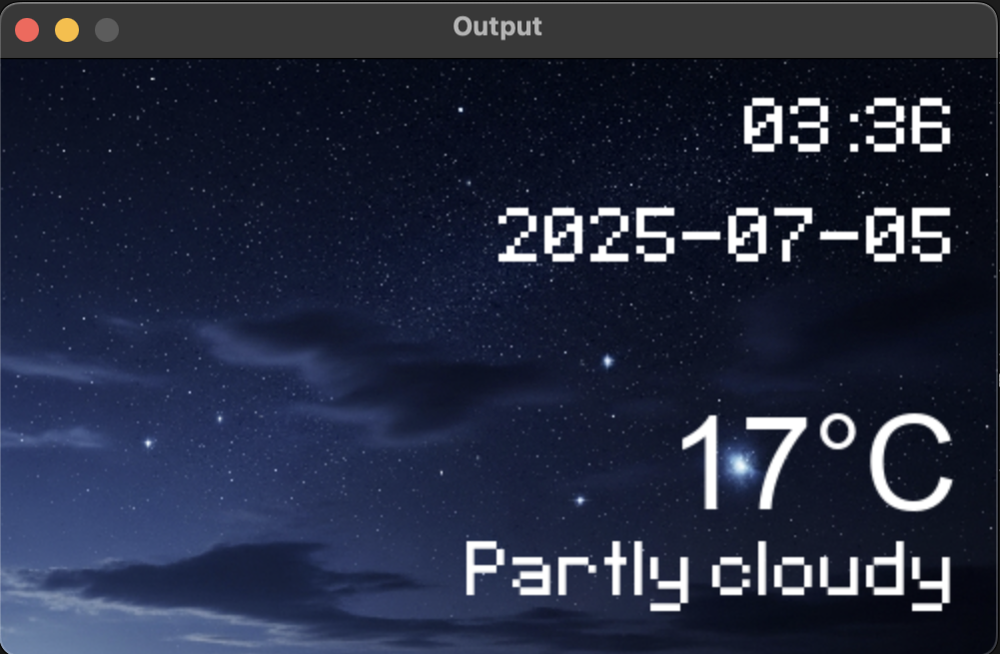

# TAKE A RAIN CHECK

## Video Demo: [Youtube](https://youtu.be/NMPwnzzhqaM)
## Description

"__TAKE A RAIN CHECK__" is a program that take a location from you as input and give you a real time weather report of any specific location in the world. 

You can start by running the main file "__project.py__". Two other files are responsible for generating Input and Output screen on your device.

## Prerequisite

In order for the program to function properly, you need to have the following pip package installed:

    - pygame
    - request
    - sys
    - json

##  Details

When you start, the Input screen will appear, prompting for your location. "__user_interface.py__ is responsible for generating the input screen. You can click on the box to activate it. The box will then start taking your input. The location can be any of the following: City, Country name; ZIP code; IP address. Ex:

     - London | E1 7JF | 51.140.125.10

A few error handles were added. Users leaving the input blank or putting non-exist location will result in the program terminate immidiately.

The main logic of the program is embedded inside "__project.py__"

Data is collect from the API provided by [Weatherstack](https://weatherstack.com/). Specifically, "https://api.weatherstack.com/" with the endpoint "_current_" to request for the real time current information. Data is updated from time to time (expect that the data can be off by a few (~~or a few dozen~~) minute). The program will then extract from the data collected the needed information and display it to the users on another output screen.

The Output screen will be generated with "__output_screen.py__", displaying information including: 

    - Date
    - Time
    - Temperature
    - Weather condition. 

Beside the formentioned data, the output screen will have different background: Bright Day-time sky, and Night-time sky as indicator for wether it is day or night at the place.

Ex:

All the user interface and display screen are developed with _pygame_ library.

## Known issues(work in progress):

The API require an API key in oder to make any request. Since I am currently on the free plan of the API provider, there can only be a limited amount of 100 request per month. In case that all the usage has exceed the allowed amount, the user will have the option to manually change to another key. 

The provided keys are stored in a directory named "__keys__" and will be updated to support more requests. Users manually change key by modify the "__get_key()__" function inside the "__project.py__" file. Basically change the number at the end of the key file. Ex:

        with open("keys/key.txt", "r") as key:

    to:

        with open("keys/key2.txt", "r") as key:

Key files are only disinguished by the number at the end of the file name.

Another option for the users to input their own API key is being developed and will be out soon.

If anyone ask me to "_Just fix it right now!_", "_Stop procastinating_", ... Well then again! I'll take a rain check